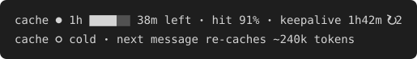

# cache-warmer for Claude Code

See whether your prompt cache is warm, and keep it warm while you step away. That way
the first message after a break doesn't re-send and re-cache the whole conversation.



## What's in the box

| Part | What it does | Setup |
|---|---|---|
| **Plugin** (`plugins/cache-warmer`) | A cache indicator under the prompt, plus `/warm`, a bounded keepalive. | Install the plugin; nothing else. |
| **Status line segment** (`statusline/cache-segment.sh`, optional) | Claude Code's own exact cache figures in colour: hit ratio, misses, last miss cause. It works standalone or after your existing status line. | One line in `settings.json`. |

## Why

Claude Code caches your conversation prefix. The cache lasts **1 hour** on a Claude
subscription (within included usage) and **5 minutes** on API keys, gateways, Bedrock,
Vertex and Foundry, unless you set
[`promptCacheTtl`](https://code.claude.com/docs/en/prompt-caching).

When the cache expires, your next message re-writes the whole context at the
cache-write rate. That rate is 2× the input price for 1h, and 1.25× for 5m. A cache
read costs 0.1×, and every read restarts the timer.

So one keepalive ping that *reads* the cache costs about 1/20 of the cold re-write it
prevents on a 1h cache, and about 1/12 on a 5m cache. It pays off when you come back.
It's wasted when you don't, which is why every window here has an end.

## Install

```
/plugin marketplace add Peek-Everything/claude-cache-warmer
/plugin install cache-warmer@claude-cache-warmer
```

To try it from a local clone instead: `claude --plugin-dir ./plugins/cache-warmer`.

Requires a Claude Code release with the plugin hooks API. It's tested on **2.1.289**;
earlier releases are untested. That API is *early access* and may change between
releases.

## Use

| Command | Effect |
|---|---|
| `/warm` / `/warm 4h` / `/warm 90m` | Keep this session warm for the auto window (default 2h) or the given time. The maximum is 8h. |
| `/warm off` / `/warm on` | Stop for this session / undo that. |
| `/warm auto on` / `/warm auto off` | Keep **every** session warm for the auto window after each reply. Applies to 1h caches only. Remembered across sessions. |
| `/warm status` | Cache state, TTL (and where it came from), keepalive state. |
| `/warm test` | Send one ping now and report what the cache served (`read` should be large and `wrote` small). |

**Settings.** The defaults below apply as soon as it's installed. To change them, run
`/plugin configure cache-warmer@claude-cache-warmer` (or edit `pluginConfigs` in `settings.json`).
The installer's note that options are "not yet set" just means the defaults are in use.


| Option | Default | |
|---|---|---|
| `auto` | `false` | Auto keepalive after each reply. `/warm auto on\|off` overrides it. |
| `autoWindowMinutes` | `120` | How long after the last reply auto keeps pinging. Maximum 480. |
| `indicator` | `true` | Show the cache indicator under the prompt. |

## How it works, and what it will never do

- **One ping:** a single tool-less request over the session's own transcript
  (`$.model.fork`), sent about 5 minutes before a 1h cache expires, or about 1 minute
  before a 5m cache does. The API serves the same prefix from cache and the timer
  restarts.
- **Not in your conversation:** nothing is added to the transcript and no turn runs,
  so your Stop/Notification hooks don't fire.
- **Nothing else is touched:** no proxy, no `ANTHROPIC_BASE_URL`, no credentials, no
  settings changes.
- **Interactive sessions only.** In `claude -p` and Agent SDK hosts it registers nothing
  and sends nothing.
- **Never pings in these cases:**
  - outside a window
  - while a turn is running
  - once the cache has already gone cold (that would only pay for a full write)
  - when `CACHE_WARMER_DISABLE=1`
  - when `~/.claude/cache-warmer-off` exists
- **Self-check:** if a ping reads nothing, or writes more than 10% of what it read, the
  keepalive stops for that session and tells you.
- **Auto never runs on a 5m cache.** A 5m cache needs about 15 pings an hour. `/warm`
  still allows it and tells you the rate first.

### How the TTL is determined
1. **Configured:** `FORCE_PROMPT_CACHING_5M`, `CLAUDE_CODE_PROMPT_CACHE_TTL`,
   `promptCacheTtl`, or `ENABLE_PROMPT_CACHING_1H`. Authoritative.
2. **Learned:** after an idle gap of 6–54 minutes, the next request's cache *writes* show
   whether the cache survived. One survival means 1h. Two full re-writes mean 5m.
   Stored per account.
3. **Guessed:** API key, auth token, base URL, or Bedrock/Vertex/Foundry set means 5m;
   otherwise 1h. A guessed TTL shows as `~1h` / `~5m` in the indicator.

## Optional: exact figures in your status line

The plugin infers cache state from response timings and token counts. Claude Code also
sends its own `prompt_cache` figures to status line commands. Those include `misses`
and `last_miss_cause`, which the plugin can't see.

```json
"statusLine": {
  "type": "command",
  "command": "/path/to/statusline/cache-segment.sh /path/to/your-existing-statusline.sh",
  "refreshInterval": 30
}
```

Leave out the second path if you have no status line. Your existing output is printed
unchanged, and the cache segment goes on its own line after it. Requires `bash`, `jq`
and `awk`.

## Limits

- **Limited testing so far:** a Linux terminal on a Claude subscription. API keys,
  Bedrock/Vertex, the desktop app, macOS and Windows are untested; reports are welcome.
- **Subscription usage limits:** how keepalive reads count toward weekly limits isn't
  documented. Watch your usage for a few days after turning on `auto`.
- **Ping output:** pings ask for a one-word reply. Models that think first may produce
  ~50–100 output tokens.
- **Approximate indicator:** the plugin's indicator is inferred. Use the status line
  segment for exact figures.

## Privacy and permissions

The plugin reads a few environment variables and settings to work out the cache TTL. It
stores timing and token counts, never prompt text. Its only network use is Claude Code's
own request over your session. [SECURITY.md](SECURITY.md) has the full list.

## Uninstall

```
/plugin uninstall cache-warmer@claude-cache-warmer
/plugin marketplace remove claude-cache-warmer
```

If you added the status line segment, restore your previous `statusLine.command`.

## Development

Working on the code, by hand or with an AI agent? See [AGENTS.md](AGENTS.md) for the
layout, the engine's rules, the invariants and the release steps.

```
claude plugin validate plugins/cache-warmer
claude plugin test plugins/cache-warmer     # 21 tests, mocked clock
statusline/test.sh                          # 9 tests
```

CI runs the status line tests and the marketplace check. The plugin checks run there as a
non-blocking job: GitHub-hosted runners currently reject the early-access hooks module, so
run the two `claude plugin` commands locally before tagging a release.

## Prior art

Ideas were weighed against
[cache-tax](https://github.com/karanb192/cache-tax) (fork-based keepalive, MIT),
[cachebeat](https://github.com/ARahim3/cachebeat),
[claude-code-cache-keepalive](https://github.com/yujiachen-y/claude-code-cache-keepalive)
and [clodex](https://github.com/avirtual/clodex). This plugin avoids transcript turns,
proxies and credential access, and adds TTL detection and an indicator.

## License

MIT
